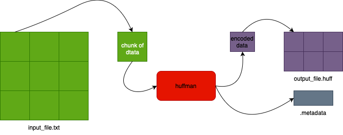

# Canonical Huffman code for compression
This repo contains *Canonical Huffman code* implementation from scratch, which can be used for text and files compression.

### Project structure
In the project directory you can find the following:
- **src** - main directory, contains all sources for compiling executable:
   - **app** - contains state machine for compress and decompress data,
   - **arg_parser** - parser for program options,
   - **huffman_utils** - contains logic for frequency table, Huffman Tree and Huffman codes,
   - **canonical_huffman** - contains logic for Canonical Huffman codes,
   - **io_utils** - contains utils for parsing program options, read and write metadata and data to file and cli.

# Algorithm Overview

### Compression steps:
1. Read data:
   - data is read in chunks until eof is reached.
2. Huffman Tree:
   - calculate frequency table,
   - create Huffman Tree with min-heap,
   - assign initial Huffman codes.
3. Canonical Huffman code:
   - sort initial Huffman codes by code length,
   - assign first character code 0 with length of Canonical Huffman code,
   - increase next character code by 0b1,
   - shift next character by length difference.
4. Decode and save data:
   - read data from file in chunks,
   - decode chunk of data with Canonical Huffman code,
   - save chunk of data to file,
5. Save metadata to ".metadata" file:
   - save Canonical Huffman code,
   - save count of shift bits.

### Decompression steps:
1. Read metadata from ".metadata" file:
   - read count of shift bits,
   - read Canonical Huffman code.
2. Read and decode Canonical Huffman codes:
   - read data in chunks,
   - decode chunk of data with Canonical Huffman code,
   - save decoded chunk of data.

# Usage
## Compiling
First you need to compile source files into one executable file. Simply start Makefile script from project folder as follows:
```console
make 
```
after compiling is completed, **huffman** executable file can be found in directory *build/*. 

## Running program
To run **main** program the following command:
```console
./build/huffman
```
also don't forget to provide *program options* for input, output and operation.

## Available program options
To compress files or text by running **main** program you should also provide paths some arguments:
- use *-i* or *--input* to compress file,
- use *-m* or *--msg* to compress text from command line,
- use *-o* or *--output* to provide output file path.

**NOTE**: *-i* and *-m* options are both xor, so you can choose one of them, otherwise program terminates with error.
Option *-o* optional, so if it's not specified the output will be printed to the command line.

**NOTE**: after decoding data all necessary metadata are saved in *.metadata* file. It can not be changed with program options, this is hardcoded name. 
**Do not change this file!**