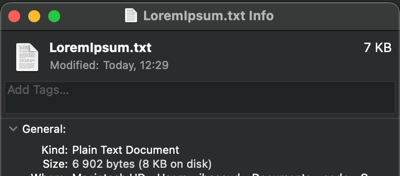
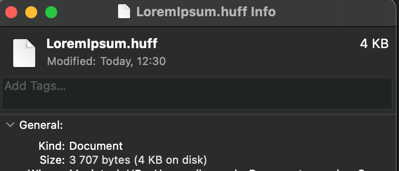

# Canonical Huffman code for compression
This repo contains *Canonical Huffman code* implementation from scratch. This can be used to compress files containing ASCII characters.

### Project structure
In the project directory you can find the following:
- **src** - directory with all sources for compiling:
    - **main.c** - entry point, contains logic to start the application,
    - **app** - contains state machine for compress and decompress data,
    - **arg_parser** - parser for program options,
    - **huffman** - contains main logic for Huffman encoding:
        - **huffman.c** - contains logic for building Huffman Tree, Huffman Codes and call Canonical Huffman, 
        - **huffman_utils** - contains logic for frequency table,
        - **canonical_huffman** - contains logic for Canonical Huffman codes,
        - **io_utils** - contains utils for parsing program options, read and write metadata and data to file.

# Algorithm Overview

### Compression steps:
1. Read data and building Frequency table:
   - read chunk of data,
   - update frequency table, which is implemented as LUT (char array of size 128 for accessing char frequency in O(1) time),
   - repeat until EOF is reached.
2. [Build Huffman Tree and assign Huffman Codes](https://en.wikipedia.org/wiki/Huffman_coding):
   - create min-heap from Frequency table based on character frequency (exclude zero frequency char),
   - build Huffman Tree with min-heap to select the two minimal nodes and insert the new one in O(n*logn) time.
   - assign initial Huffman codes.
3. [Canonical Huffman code](https://en.wikipedia.org/wiki/Canonical_Huffman_code):
   - sort Huffman codes by code length,
   - create Canonical Huffman table for codes as LUT,
   - assign first character code 0 with length of Huffman code,
   - increase next character code by 0b1, 
   - shift character code by difference in code length.
4. Encode and save data:
   - read chunk of data,
   - encode chunk of data with Canonical Huffman table,
   - save chunk of data to file,
   - repeat until EOF is reached.
5. Save metadata:
   - transform Canonical Huffman table to format for saving,
   - save count of shift bits, codes and number of significant bits for each code to *.metadata*.

### Decompression steps:
1. Read metadata:
   - read count of shift bits,
   - read Canonical Huffman codes and save as LUT.
2. Read and decode data:
   - read data in chunks,
   - decode chunk of data with Canonical Huffman code,
   - save decoded chunk of data,
   - repeat until EOF is reached.

# Usage
## Compiling
First compile source files into one executable file. Simply start Makefile script from project folder as follows:
```console
make 
```
after compiling is completed, **huffman** executable file can be found in *build/* directory. 

## Running program
To run **main** program the following command:
```console
./build/huffman
```
also don't forget to provide *program options* for input, output and operation.

### Available program options
To compress files or text by running **main** program you should also provide paths some arguments:
- use *-i* or *--input* for input file,
- use *-o* or *--output* for output file,
- use *-c* for compression,
- use *-d* for decompression.

**NOTE**: after data compression is finished successfully, metadata are saved in *.metadata* file. 

**NOTE**: The output file is written in chunks. If the specified output file already exists, the data will be appended to the end instead of overwriting the file.

### Examples
Example of input text can be found in *input/* directory.
#### Compression example:
```console
./build/huffman -i input/LoremIpsum.txt -o output/LoremIpsum.huff -c
```
this command will result in a compressed *LoremIpsum.huff* file of 3707 bytes instead of the original 6902 bytes:


#### Decompression example:
```console
./build/huffman -i output/LoremIpsum.huff -o output/LoremIpsum_decoded.txt -d
```
this command will result in a decompressed *LoremIpsum_decoded.txt* file with original text from *LoremIpsum.txt*.